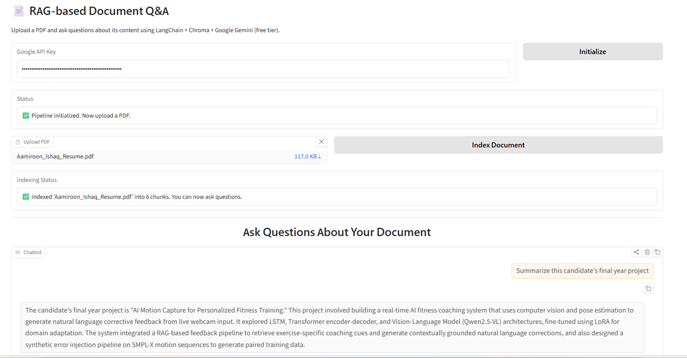

# RAG Document Q&A

A Retrieval-Augmented Generation (RAG) app that lets you upload a PDF and ask natural-language questions about its content — built with **LangChain**, **Chroma**, and **Google Gemini** (free tier), wrapped in a **Gradio** UI.

## Demo



## How It Works

1. **Load** – PDF parsed with `PyPDFLoader`
2. **Chunk** – split into overlapping chunks via `RecursiveCharacterTextSplitter`
3. **Embed & Store** – chunks embedded with `gemini-embedding-001` and stored in **Chroma**
4. **Retrieve & Generate** – relevant chunks retrieved and passed to `gemini-2.5-flash` to generate grounded answers

## Tech Stack

LangChain · Chroma · Google Gemini · Gradio · PyPDF

## Setup

```bash
git clone <repo-url>
cd rag-doc-qa
pip install -r requirements.txt
```

Get a **free** Gemini API key at [aistudio.google.com/app/apikey](https://aistudio.google.com/app/apikey).

Create a `.env` file from `.env.example`:

## Run

```bash
python app.py
```

1. Enter your API key and click **Initialize**
2. Upload a PDF and click **Index Document**
3. Ask questions in the chat box

## Possible Extensions

- Support for DOCX, TXT, and web pages
- Multi-document collections with source citations
- Conversation memory for follow-up questions

## License

MIT